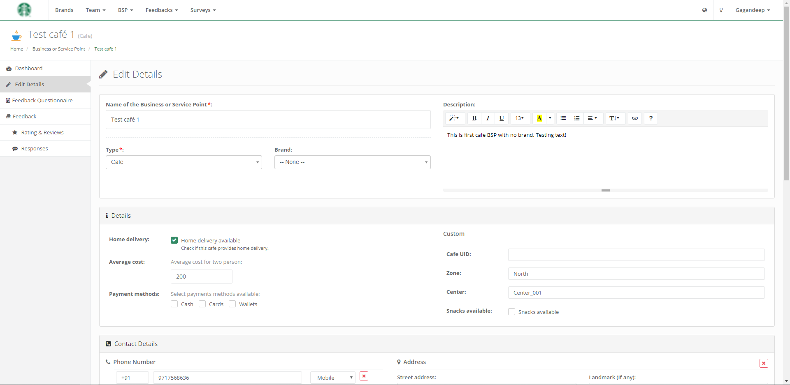

**(2016-2017: Part-time project. This project is partially completed and has not been maintained from a long time)**


#  Feedvay (2016-2017)

Feedvay (Combination of word Feedback and Survey) is cloud based SaaS platform that provides individual or organization,
an online platform to conduct surveys or obtain customer feedback and analyse responses, generate visuals and reports.

Feedvay was a part-time project which started with an idea to address various engineering challenges for developing
cloud based platform in Django web framework, however, it was later directed towards a specific use case around a user
friendly, UI extensive form builder tool which can be extended for Survey, Feedback, Quiz etc like online services.


#### Development Stack:

Feedvay is a full stack development project primarily based on **Python-Django** web framework and uses hybrid approach:


- **Backend:** MySQL, MongoDB
- **Web Framework:** Django with Python programming language
- **Frontend:** Javascript, Jquery, AngularJS, HTML5, CSS
- **Web Server & OS:** Nginx, Ubuntu
- **Hosting Cloud:** Amazon Web Services (VPC, EC2, S3, Load Balancer etc) 
- **Third-Party Services:** Google Firebase (FCM), Indico.io 


## Key Components

- **User, Permissions, Roles, Session Management:** [Documentation](/docs/build/html/modules/accounts/index.html)
- **Client Specific UI Themes:** [Documentation](/docs/build/html/modules/main/mod_theme.html)
- **Country's Administrative Division Modeling:** [Documentation](/docs/build/html/modules/geography/index.html)
- **Language and translations:** [Documentation](/docs/build/html/modules/languages/index.html)
- **Reporting and Visualization:** [Documentation](/docs/build/html/modules/reports/index.html)
- **Watchdog:** To report and manage errors in the system [Documentation](/docs/build/html/modules/watchdog/index.html)
- **Owlery:** Messaging, Email, Notifications, SMS [Documentation](/docs/build/html/modules/owlery/index.html)
- **Form Builder - Survey & Feedbacks:** [Documentation](/docs/build/html/modules/form_builder/index.html)

    [](_readme/images/Feedvay_FormBuilder_Demo.gif)

## Documentation

Check out the complete [Sphinx](docs/build/html/modules) documentation of the project containing details of the the modules and various diagrams & illustrations.

[](docs/build/html/modules)

## Screenshots

|    |   |
|---|---|
|    |   |
|    |   |
|    |   |
|    |   |
|    |   |
|    |   |

_**Note:** All brand/organization name or logo in the project are used for demonstration purpose only._

## Requirements

- Python 2.7
- Django 1.10.2 or later
- MySQL 5.7
- MongoDB 

Refer [requirements.txt](requirements.txt) for complete python dependencies.


## How to run

- Clone repository into your local machine directory.
- Create python virtual environment and activate it.
- Install all python dependencies using [requirements.txt](requirements.txt). Some of them have been commented, install them manually.
- Navigate into the project directory and edit [settings.py](feedvay/settings.py) file. Configure all database settings, AWS keys etc.
- Create superuser using following command: 
    ```python manage.py createsuperuser```
- Run following command to initialize system: 
    ```python manage.py initialize_system```
- Finally, run django project using:
    ```python manage.py runserver```
- In the browser, 
    - Goto [http://127.0.0.1:8000/accounts/login/](http://127.0.0.1:8000/accounts/login/) to login into the portal.
    - Goto [http://127.0.0.1:8000/admin/](http://127.0.0.1:8000/admin/) to open django admin.
    


