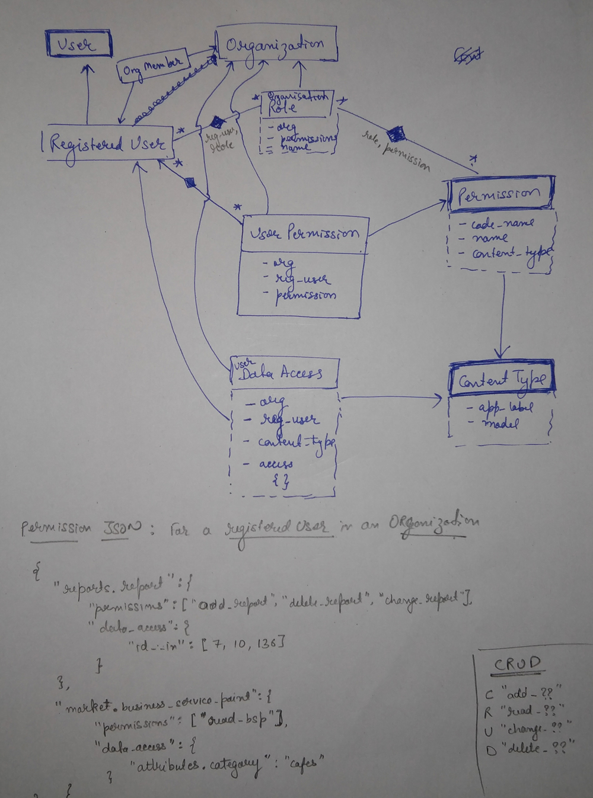

User permissions, roles and access management
=============================================

This sections discusses architecture for **RegisteredUser** permissions for an **Organization**. All permissions, roles and
data access are always in context of organization only. Since a user can be associated to multiple organizations,
the user has multiple sets of permissions, roles and data access for that organization.

This module is inspired by django permission framework and uses the same concept but defining permissions in context of
an organization. It also expands the framework to defined permissions at resource level as well that is what data/record
instances are permitted to the user.

The basic idea behind user permissions is to obtain a permission JSON when required which can be easily looked up to
find a particular permission and data access. The data is stored in databases such that JSON can be easily and quickly
obtained at runtime with minimum operation cost. In order speed up the process and avoid unnecessary overheads, **caching**
is used to cache permission json and subsequent permission requests can be served from cache rather than hitting database.

Following diagram explains the architecture for permissions, roles and data access for a registered user only:

Obtain user permissions
-----------------------

For permission JOSN structure and methods to obtain permissions, kindly refer :class:`accounts.models.RegisteredUser` methods:

    - :py:func:`accounts.models.RegisteredUser.get_perm_cache_key`
    - :py:func:`accounts.models.RegisteredUser.fetch_all_permissions`
    - :py:func:`accounts.models.RegisteredUser.get_data_access`
    - :py:func:`accounts.models.RegisteredUser.get_all_permissions`
    - :py:func:`accounts.models.RegisteredUser.delete_permission_cache`

Some Anomalies
--------------

There are few areas that might not follow above described conventions. These anomalies are:

    - **BSP Feedback Form Association**: Although BSPFeedbackForm has its own permissions, but association of them with the BSP is
      determined as per access over :class:`market.models.BusinessServicePoint`.
    - **BSP Feedback Responses/Rating/Comments**: These are as per access over :class:`market.models.BusinessServicePoint`. That is, it user has access
      over the BSP, he can view responses/rating/comments on them. However, ability to reply on comments are determined from its permissions.
    - **Data access for BSP**: Currently data access for :class:`market.models.BusinessServicePoint` is determined from
      filters specified in :class:`accounts.models.UserDataAccess`. However, this will be changed and will be
      determined from organization hierarchy. The flow is design is yet to be planed.

Django views decorator
----------------------

A decorator on every view that requires certain permissions to allow access.
Kindly refer the decorator :py:func:`accounts.decorators.organization_console`.

