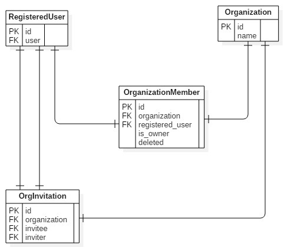

User-Organization membership
============================

This section discusses how a registered user is associated or member of an organization. All user can
either work as individual (currently disabled) or under one or more organization. The schema is as follows:

User association
----------------

A user can be associated to an organization in following ways:

    1. **While creating organization**: The user who creates organization is by default associated with organization
       as owner.
    2. **By invitations**: A user who is already a member of an organization can invite a user to become a member of the
       organization
    3. **Manually by staff**: A staff member who has privileges can manually associate a user from admin on demand basis.

User disassociation
-------------------

A user can only be disassociated by a user higher in hierarchy of the organization.

